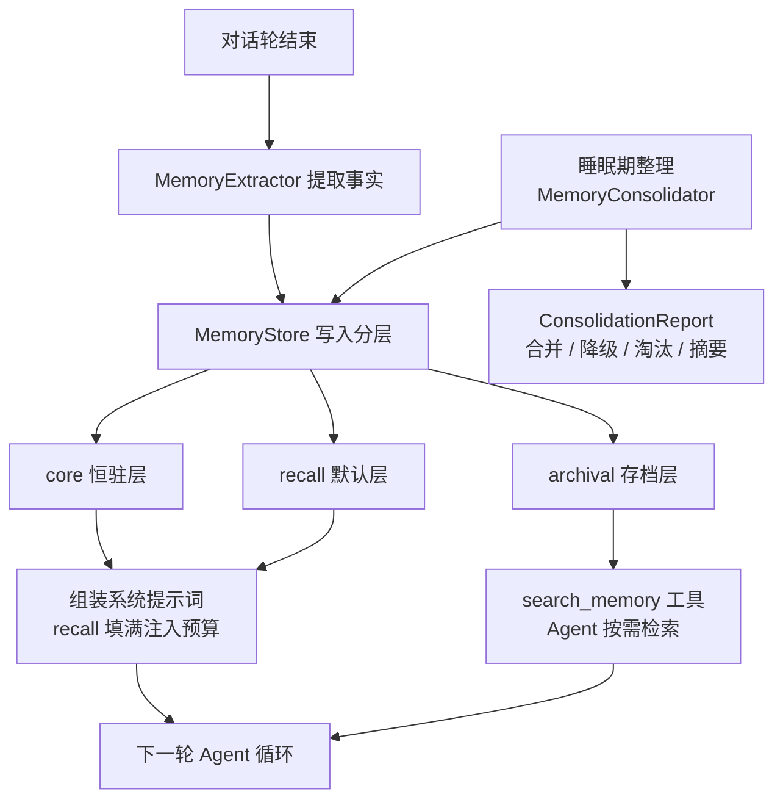
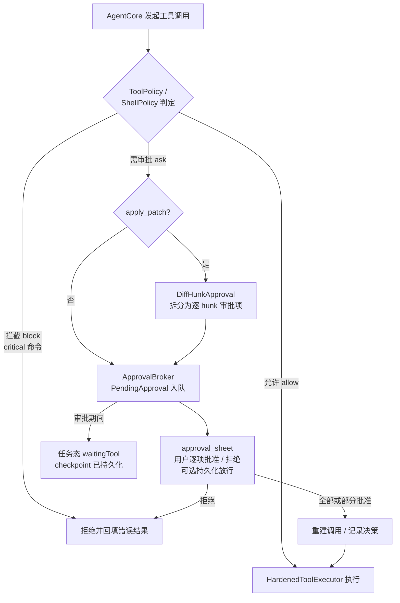

# 架构说明(Flutter 主线)

本文对应 `flutter/` 下的 Dart 实现。旧 TypeScript 核心(`src/`)的分层文档见 [platform-adapters.md](platform-adapters.md),两者共用同一套设计约束:平台 I/O 由适配器注入,核心不依赖具体平台。

## 总体分层

```text
features/   页面:chat / tasks / history / capabilities / memory / profile / approval,
            由 features/shell/home_shell.dart 以五 Tab(对话/任务/历史/能力/我的)组装
state/      Riverpod 装配层:chat_session、任务调度、设置存储、用量统计
core/       引擎与平台无关逻辑(下文逐模块说明)
platform/   平台通道适配:SAF 工作区、进程执行、语音、安全存储、shared intent
design/     design tokens + 亮/暗主题 + 通用组件
```

依赖方向只能从 UI 指向 core;core 中的 Flutter 依赖仅限 foundation 层(如 `crash/`、`platform/background_tasks.dart` 的通道封装),引擎本身可在纯 Dart 环境(如 `tool/mcp_bridge.dart` 桌面侧车)运行。

## core/ 模块逐个说明

| 目录 / 文件 | 职责 |
| --- | --- |
| `agent_core.dart` | Agent 主循环:每轮 组装提示词 → 调网关 → 解析工具调用 → 执行 → 回填结果;受 `AgentLimits`(16 轮 / 64k token / 32 工具调用)约束,全程写 checkpoint |
| `runtime/` | `AgentContext` + `AgentRuntime`(Hermes 钩子内聚)、`HardenedToolExecutor`(工具执行加固:超时、结果截断)、`tool_registry.dart` 注册缝隙 |
| `approval_broker.dart` | 审批中枢:`PendingApproval` 队列,审批决策可持久化放行(PHASE 50 白名单);`diff_hunk_approval.dart` 把 `apply_patch` 拆为逐 hunk 的独立审批项,再从已批准 hunk 重建补丁 |
| `task_queue.dart` | `TaskCoordinator` 任务运行时:`TaskState` 含 queued / waitingTool / paused / recovering;并发上限、排队、暂停、丢弃 |
| `task_recovery.dart` | 进程死亡恢复:扫描持久化的任务记录与 checkpoint,产出恢复候选 |
| `context/context_compactor.dart` | CJK 感知的确定性 token 估算与上下文压缩,压缩边界与 checkpoint 兼容(可恢复) |
| `gateway/` | `openai_gateway.dart` OpenAI 兼容 SSE 流式网关(按模型 temperature / top_p,统计 prompt cached tokens);`providers.dart` Provider 预设与自定义端点;`model_discovery.dart` `GET /models` 发现;`web_search.dart` 按模型注入厂商联网搜索开关的请求体装饰器;`context_window.dart`、`sse.dart` |
| `shell/shell_executor.dart` | 命令执行:风险四级 `low / medium / high / critical`;low 放行、medium/high 询问、critical 直接拦截(一票否决);超长输出截断防止撑爆上下文 |
| `tools/` | 工具注册表与实现:`workspace.dart`(read_file / write_file / apply_patch / list_files / exists / search_files)、`terminal_tools.dart`(`fast_find`=fd→find 回退,`smart_grep`=rg→grep 回退,返回 JSON)、`notes_tool.dart`(`plan` / `note`,每轮回注 todo-recitation)、`memory_search_tool.dart`(`search_memory`,archival 记忆的取用通道)、`audit.dart` |
| `memory/` | Letta 式三层个人记忆:`memory_store.dart`(`MemoryTier.core / recall / archival` + `MemoryStore`)、`memory_extractor.dart`(对话结束轮提取事实)、`consolidation.dart`(睡眠期整理:合并 / 降级 / 淘汰 / 摘要,产出 `ConsolidationReport`) |
| `hermes/` | 项目级知识账本:JSONL 为唯一事实源 + Markdown 投影、反思归并(`reflection.dart`)、遗忘策略(`forgetting.dart`)、`knowledge_tool.dart` 提供 Agent 可调用入口 |
| `mcp/` | `mcp_client.dart` MCP HTTP 客户端 + `mcp_tool_registry.dart`;`mcp_guard.dart` 对工具目录(名称 + 描述 + 参数 schema)做 SHA-256 指纹,审批后目录漂移即失效重审(防 tool poisoning / rug pull);桌面侧车 `bridge_server.dart` / `bridge_client.dart` / `bridge_dashboard.dart`,协议见 `bridge_protocol.md` |
| `dsh/` | 声明式插件系统:manifest 校验(反向 DNS / semver / 权限)、生命周期 registry、信任策略(unknown=block / new=ask)、安装器(暂存 `.shelly/plugins/`)、Hermes 联动桥 |
| `workspace/` + `git/` | `WorkspaceManager` 项目检测与快照 diff;`GitManager`(porcelain v1)+ `GitSandbox` 全量快照回滚 |
| `platform/` | 平台无关的桥接口:`background_tasks.dart`(WorkManager 唤醒,通道 `dev.shelly/bg_tasks`,原生侧 `BackgroundTaskWorker.kt`)、`home_widget_bridge.dart`(桌面小部件) |
| `crash/`、`diagnostics/`、`tts/`、`lan/` | 崩溃记录存储、环境体检、TTS 接口(`flutter_tts` 藏在接口后)、LAN 伴侣服务 |
| `models.dart`、`agent_profile.dart`、`error_messages.dart`、`diff_approval.dart` | 领域类型(`AgentLimits` / `PendingToolCall` 等)、Agent 人设预设、错误文案、diff 审批数据结构 |

原生侧(Android,`flutter/android/`):`MainActivity.kt`、`BackgroundTaskWorker.kt`(WorkManager 唤醒)、`TaskForegroundService.kt`、`SecureStore.kt`、`HomeWidgetProvider.kt`。

## 记忆分层数据流

`memory/` 的三层:core 恒驻系统提示词(免于年龄淘汰)、recall 按「最新优先」填自动注入预算、archival 仅经 `search_memory` 工具按需取用。



归档事实只有一条取用路径(`tools/memory_search_tool.dart`),因此「不自动注入」不等于「不可达」。

## 审批流

每个工具调用都要过策略闸门;写文件类拆到 hunk 粒度,Shell 命令拆到风险等级。



审批等待期任务处于 `waitingTool`,checkpoint 已落盘;进程被杀后 `task_recovery.dart` 仍能把任务(含未决审批)恢复回来。

## 测试金字塔

```text
        eval 基线(10 场景轨迹)
       ─────────────────────────
      组件测试(widget)页面与状态
     ────────────────────────────────
    单元测试(core 引擎 / 策略 / 记忆)
```

- **单元测试**:`flutter/test/` 下按模块覆盖引擎、策略、网关、记忆、MCP、任务恢复等,共 620+ 用例。
- **组件测试**:页面与 Riverpod 状态(对话流、审批卡、五 Tab 壳)。
- **eval 轨迹基线**:`test/eval/`,驱动真实 `AgentCore` + 工具注册表 + 策略引擎,网关用脚本回放、shell 拒绝真实 spawn,全封闭可复现。10 个场景(读后总结、写新文件、补丁、先搜后读、多步编辑、工具错误恢复、拦截 `rm -rf`、记忆注入、无工具直答、清点后确认),按「结果 + 轨迹」双 rubric 评分,无 LLM 裁判。详见 `test/eval/README.md`。

## 发布流水线

`.github/workflows/flutter.yml`:

1. **build**(push / PR / tag):`flutter analyze` → `flutter test` → 构建 debug + release APK → 生成 `SHA256SUMS` → 上传 artifact。
2. **release**(仅 `v*` tag):下载 release artifact,重命名为 `shelly-hermes-<tag>.apk`,经 `softprops/action-gh-release` 发布 GitHub Release(附 SHA256SUMS)。
3. 签名:密钥不入库;`android/key.properties` 缺失时 release 构建回退 debug 签名。
4. tag 构建不被并发取消(`cancel-in-progress` 对 tag 恒为 false),保证 Release 必然走完。

E2E 由 `.github/workflows/flutter_e2e.yml` 单独承担。版本号单一事实源:`flutter/pubspec.yaml`(`version: 2.3.0+4`)与根目录 `version-manifest.json`。
