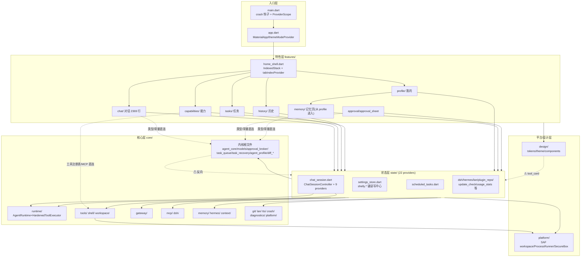

# Shelly Hermes 当前架构盘点(PHASE 0 审计 · 工作区 A)

> 审计基线:commit `5c46be2`(PHASE 54),`flutter/lib` 共 107 个 Dart 文件。
> 本文所有结论均来自对实际代码的阅读,每个论断附文件路径;`dart analyze` 无告警、`flutter test` 648 项全绿(2026-09-09 于本分支验证)。
> 代码零改动;本文与 `MODULE_MAP.md`、`DEPENDENCY_MAP.md` 同属 PHASE 0 审计文档集。

---

## 1. 总体分层

代码位于 `flutter/lib/`,自下而上共 5 层。方向是严格的"上层依赖下层":

```
入口层 (main.dart / app.dart)
   ↓
特性层 (features/ — 5 个 Tab 页面 + 审批弹窗)
   ↓
状态层 (state/ — Riverpod provider + 控制器/存储)
   ↓
核心层 (core/ — Agent 内核 + 能力目录)
   ↓
平台层 (platform/ + design/ — 平台通道与设计系统)
```

例外(反向/跨层依赖,详见 `DEPENDENCY_MAP.md` §3):`core/tools/memory_search_tool.dart` 反向 import `state/settings_store.dart`;`design/components/tool_card.dart` 依赖 `state/chat_session.dart` 的 `ToolEntry`。

### 1.1 入口层

| 文件 | 职责 | 证据 |
| --- | --- | --- |
| `flutter/lib/main.dart` | `main()` 先 `WidgetsFlutterBinding.ensureInitialized()` + `SemanticsBinding.instance.ensureSemantics()`(为浏览器验证工具暴露语义树),再 `_installCrashLogging()`(把 `CrashLogStore(prefs)` 挂进全局错误钩子,失败静默放行),最后 `runApp(const ProviderScope(child: ShellyApp()))`。Riverpod 根作用域在此创建 | `flutter/lib/main.dart:9-29` |
| `flutter/lib/app.dart` | `ShellyApp` = `MaterialApp`,挂 `buildShellyTheme(Brightness.light/dark)` 双主题与 `themeModeProvider`;`home: HomeShell()`。`themeModeProvider` 是 `StateProvider<ThemeMode>`,web 调试支架支持 `?theme=dark|light` 深链 | `flutter/lib/app.dart:10-35` |

启动顺序(隐式契约):crash 钩子 → `ProviderScope` → MaterialApp/主题 → `HomeShell.initState`(见 §5)。

### 1.2 核心层:`lib/core` 根文件 = Agent 内核

`lib/core/` 根下 7 个文件构成与 Flutter 无关的引擎内核(可跑纯 `dart test`,文件头注释明示"Deliberately free of Flutter and platform imports"):

| 文件 | 关键内容 | 说明 |
| --- | --- | --- |
| `core/models.dart` | `MessageRole`、`AgentMessage`(含 images/textFiles)、`ToolCall`、`ModelReply`、`AgentLimits{maxRounds=16, maxTokens=64000, maxToolCalls=32}`、`PendingToolCall`/`ToolExecutionStage`、`AgentCheckpoint`(version:1 JSON)、`sealed AgentEvent` 家族(`ModelStarted/ModelDelta/ModelFinished/ApprovalWaiting/ApprovalFinished/ToolStarted/ToolFinished/ContextCompacted`)、`ApprovalDecision` | 引擎数据模型,注释注明 1:1 移植自 Kotlin `AgentModels.kt`;372 行 |
| `core/agent_core.dart` | `AgentCore.run()` 主循环:`while (round < limits.maxRounds)` 中依次做取消检查 → 上下文压缩(contextCompactor)→ 模型调用(优先 streaming)→ token 预算检查(`consumedTokens > limits.maxTokens` → `AgentStopped('token_budget_exceeded')`)→ 工具调用预算检查(`maxToolCalls`)→ 逐 hunk 审批(`DiffHunkApproval.expand/collapse`)→ 恢复时先排空 pendingToolCalls(RUNNING 态不静默重跑,回问用户)。接口面:`ModelGateway`/`StreamingModelGateway`/`ToolExecutor`/`ApprovalGateway`/`CheckpointStore`/`AgentObserver`/`ToolApprovalPolicy`(含 `toolApprovalRequireAll` 与 `AutoApproveReadOnlyPolicy`) | 376 行,引擎心脏 |
| `core/approval_broker.dart` | `ApprovalBroker implements ApprovalGateway`:Completer 挂起式人工审批;PHASE 48 会话级 always-allow 集合 + PHASE 50 可选持久化组合(`initialPersistentAllow`/`onAllowAlwaysPersist`/`clearPersistentAllow`),broker 自身不落盘 | 133 行 |
| `core/task_queue.dart` | `TaskState` 11 态(queued/paused/recovering/starting/running/waitingTool/stopping/cancelling/completed/stopped/failed)、`TaskStatus`、`TaskCoordinator`:并发槽(`maxConcurrent`)、`start/enqueue/pause/resume/cancel`,`_drain()` 排队 | 280 行 |
| `core/task_recovery.dart` | `TaskRecoveryRecord`、`RecoveryCandidate`、`TaskRecoveryStore` 接口、`TaskRecovery.scan()`:进程被杀后按"运行记录 + 检查点"双条件判定可恢复任务 | 78 行 |
| `core/agent_profile.dart` | `AgentProfile`:人格预设(systemPrompt/maxRounds/maxToolCalls/autoCapture/providerId),内置 presets 不可就地编辑(`asEditableCopy`) | 纯数据 |
| `core/diff_approval.dart` + `core/diff_hunk_approval.dart` | `DiffHunk` 渲染模型;`DiffHunkApproval.expand()` 把 `apply_patch` 拆成逐 hunk 审批调用、`collapse()` 重组已批准 hunks | 审批 UI 的数据底座 |
| `core/error_messages.dart` | `humanizeAgentError()`:把 `GatewayException` 等映射成中文一句话(保留状态码/原始文本) | 依赖 `gateway/openai_gateway.dart` |

### 1.3 核心层:`lib/core/` 能力目录(16 个,各 1–7 文件)

| 目录 | 文件数 | 内容 | 关键类 |
| --- | --- | --- | --- |
| `core/runtime/` | 4 | 引擎组装与执行护栏 | `AgentRuntime`(Hermes 回忆/记忆、策略装配,`agent_runtime.dart:15-24`)、`AgentContext`(`AgentMemoryAccess` 接口)、`AgentToolRegistry` + `CompositeToolRegistry`(先声明者赢,防插件遮蔽平台工具,`runtime/tool_registry.dart:37-50`)、`HardenedToolExecutor`(120s 超时 + 20k 字符截断 + 摘要器,`hardened_tool_executor.dart:11-25`) |
| `core/tools/` | 6 | 工具实现 | `Workspace` 抽象 + `MemoryWorkspace`(workspace.dart:17-49)、`WorkspaceToolRegistry`(workspace.dart)、`ToolPolicy`(allow/confirm/deny,registry.dart:9-73)、`NotesToolRegistry`(plan/notes 朗诵,notes_tool.dart:20)、`TerminalSearchTools`(fd/rg 结构化搜索,terminal_tools.dart:21)、`MemorySearchToolRegistry`(search_memory 自诊断,PHASE 43/52,memory_search_tool.dart:24)、`JsonlAuditLog`(审计观察者,audit.dart:23) |
| `core/shell/` | 1 | Shell 执行 | `ShellPolicy`/`ShellRiskClassifier`/`ShellExecutor`、`ShellToolRegistry`、`ShellApprovalPolicy`(shell_executor.dart:24-302);`ProcessRunner` 接口实现在 `platform/process_runner_*.dart` |
| `core/gateway/` | 6 | OpenAI 兼容网关 | `OpenAiCompatibleGateway implements StreamingModelGateway`、`CachedTokensReply`(KV-cache 可见性 PHASE 46)、`ChatTransport`/`HttpChatTransport`、`SseParser`、`ModelDiscovery`/`ModelsTransport`、`llmProviderPresets`(providers.dart:36)、`context_window.dart` 上下文窗估算 |
| `core/memory/` | 3 | 分层长期记忆(PHASE 47/52) | `MemoryFact`/`MemoryStore`(memory_store.dart:23/129)、`MemoryExtractor`(memory_extractor.dart:17)、`MemoryConsolidator` + `ConsolidationReport`(consolidation.dart:102/35) |
| `core/hermes/` | 7 | 知识账本(Hermes ledger) | `KnowledgeEntry`(knowledge.dart:3)、`HermesKnowledgeStore`(knowledge_store.dart:11)、`KnowledgeToolRegistry`(knowledge_tool.dart:13)、`HermesMemory implements AgentMemoryAccess`(hermes_memory.dart:16)、`ForgettingPolicy`(forgetting.dart:8)、`Reflector`(reflection.dart:9)、`MemorySettings`(memory_settings.dart:5) |
| `core/context/` | 1 | 上下文压缩 | `ContextCompactor`(context_compactor.dart:118,含 PHASE 46B 可恢复压缩) |
| `core/mcp/` | 6 | MCP 客户端与桥 | `McpClient`/`McpServerConfig`(mcp_client.dart:84/10)、`McpToolRegistry`(mcp_tool_registry.dart:19)、`McpGuard`/`McpGuardLedger`(供应链指纹,PHASE 46A,mcp_guard.dart:98/237)、`BridgeServer`(桌面 sidecar stdio↔HTTP,PHASE 45,bridge_server.dart:111)、`BridgeClient`、`BridgeDashboard`(PHASE 49,bridge_dashboard.dart:121) |
| `core/dsh/` | 6 | 动态插件宿主(PHASE 11-16) | `DshManifest`/`DshPermissions`(manifest.dart)、`DshPlugin`/`DshHostContext`(plugin.dart:122/26)、`DshPluginRegistry`(registry.dart:11)、`DshToolRegistry` + `DshTrustPolicy`(tool_registry.dart:39/16)、`DshInstaller`(installer.dart:15) |
| `core/workspace/` | 2 | 工作区管理 | `WorkspaceManager`/`WorkspaceSnapshot`(workspace_manager.dart:32/78)、`ProjectDetector`/`ProjectInfo`(project.dart:49/10) |
| `core/git/` | 2 | Git 集成 | `GitManager`/`GitStatus`(git_manager.dart:50)、`GitSandbox`/`SandboxSession`/`RollbackReport`(git_sandbox.dart:54/7/22) |
| `core/lan/` | 1 | LAN 伴生服务(PHASE 42) | `LanCompanionServer`(lan_companion_server.dart:29) |
| `core/tts/` | 1 | 朗读 | `TtsService` 接口 + `FlutterTtsService`(tts_service.dart:10/23) |
| `core/platform/` | 2 | 平台桥 | `HomeWidgetBridge`(PHASE 42,home_widget_bridge.dart:24)、`BackgroundTaskBridge`(PHASE 45 后台任务唤醒,background_tasks.dart:29) |
| `core/crash/` | 1 | 崩溃日志 | `CrashEntry`/`CrashLogStore`(crash_log_store.dart:12/49) |
| `core/diagnostics/` | 1 | 环境自检 | `EnvironmentChecker`/`EnvironmentCheck`(environment_checker.dart:44/8) |

内核依赖方向干净:`core/` 各能力目录只引用 `../models.dart`、`../agent_core.dart`、`../approval_broker.dart`、`../tools/registry.dart` 等内核文件(全量 grep 见 `DEPENDENCY_MAP.md` §2),唯一例外是 §3.1 的 memory_search_tool 反向依赖。

### 1.4 平台层:`lib/platform/` 与设计层 `lib/design/`

- `platform/platform_workspace.dart:17/111/173`:`PlatformWorkspace`(Android SAF 经 MethodChannel)、`ResilientWorkspace`(回退到内存沙箱)、`createWorkspace()` 工厂(`state/chat_session.dart:1565` 的 `workspaceProvider` 用它)。
- `platform/process_runner.dart`(6 行接口)+ `process_runner_io.dart`(IO 实现)/`process_runner_stub.dart`(web 桩):条件导入让 shell 在 web 上安全降级。
- `platform/secure_box.dart`:API key 的 AndroidKeyStore 加密盒(`state/settings_store.dart:12` 使用)。
- 其余:`speech.dart`(语音输入)、`tts` 由 core 调插件、`conversation_images.dart`(附件图缓存)、`shared_intent.dart`(分享接收)、`task_service.dart`。
- `design/`:tokens.dart(AppTokens/AppSemanticColors)、theme.dart(buildShellyTheme)、components/ 10 个组件(buttons/code_block/empty_state/gradient_avatar/markdown_text/motion/risk_chip/skeleton/tool_card)。全部只依赖 tokens,唯一例外 tool_card 依赖 state(§3.1)。

## 2. 状态管理层(Riverpod Provider 全量清单)

状态管理用 `flutter_riverpod ^2.6.1`(`flutter/pubspec.yaml` dependencies 段)。全部 provider 共 22 个,声明集中在 `state/` 9 个文件 + `app.dart` 1 个;features 层不声明任何 provider(只 watch/read)。类型与文件:

| Provider | 类型 | 声明位置 |
| --- | --- | --- |
| `themeModeProvider` | `StateProvider<ThemeMode>` | `flutter/lib/app.dart:10` |
| `workspaceProvider` | `Provider<Workspace>`(SAF/内存工厂) | `flutter/lib/state/chat_session.dart:1565` |
| `workspaceAuthorizedProvider` | `FutureProvider.autoDispose<bool>` | `chat_session.dart:1570` |
| `workspaceManagerProvider` | `Provider<WorkspaceManager>` | `chat_session.dart:1580` |
| `approvalQueueProvider` | `StateProvider<List<PendingApproval>>`(引擎顺序 FIFO) | `chat_session.dart:1587` |
| `taskHistoryProvider` | `StateProvider<List<TaskStatus>>`(上限 50 条) | `chat_session.dart:1593` |
| `conversationImageStoreProvider` | `FutureProvider<ConversationImageStore?>`(降级为 null) | `chat_session.dart:1600` |
| `chatGatewayOverrideProvider` | `Provider<ModelGateway?>`(`@visibleForTesting`,测试注假网关) | `chat_session.dart:1617` |
| `memoryStoreProvider` | `FutureProvider<MemoryStore?>`(失败→null 静默降级) | `chat_session.dart:1622` |
| `chatSessionProvider` | `StateNotifierProvider<ChatSessionController, ChatSessionState>` | `chat_session.dart:1630` |
| `dshRegistryProvider` | `Provider<DshPluginRegistry>` | `flutter/lib/state/dsh_provider.dart:8` |
| `dshTrustProvider` | `Provider<DshTrustPolicy>` | `dsh_provider.dart:12` |
| `dshToolsProvider` | `Provider<DshToolRegistry>`(watch 前两者) | `dsh_provider.dart:16` |
| `hermesLedgerProvider` | `FutureProvider.autoDispose<HermesLedgerSnapshot>`(watch workspace/manager/settings) | `flutter/lib/state/hermes_provider.dart:89` |
| `settingsStoreProvider` | `FutureProvider<SettingsStore>`(构造后 `restoreApiKey()`) | `flutter/lib/state/settings_store.dart:577` |
| `scheduledTaskStoreProvider` | `FutureProvider<ScheduledTaskStore>` | `flutter/lib/state/scheduled_tasks.dart:509` |
| `schedulerServiceProvider` | `FutureProvider<SchedulerService>`(watch store + settings) | `scheduled_tasks.dart:515` |
| `scheduledTasksRevisionProvider` | `StateProvider<int>`(任务页改动→shell 重挂 ticker) | `scheduled_tasks.dart:523` |
| `lanCompanionProvider` | `StateNotifierProvider<LanCompanionController, LanCompanionState>` | `flutter/lib/state/lan_companion.dart:287` |
| `pluginRepoProvider` | `FutureProvider<PluginRepoStore>`(watch settingsStore) | `flutter/lib/state/plugin_repo.dart:167` |
| `updateCheckProvider` | `FutureProvider<UpdateCheckService>` | `flutter/lib/state/update_check.dart:219` |
| `usageStatsProvider` | `FutureProvider<UsageStatsStore>` | `flutter/lib/state/usage_stats.dart:215` |

无 provider 的 state 文件是纯服务/纯函数:`conversation_export.dart`、`conversation_search.dart`(57/59 行)、`memory_maintenance.dart`(`MemoryMaintenanceService`,day-throttle)。

### 2.1 状态层两大控制器

- `ChatSessionController extends StateNotifier<ChatSessionState>`(`chat_session.dart:182` 起):持有自己的 `ApprovalBroker`(`:196`)、`_ApprovalRouter` 路由到 chat 页注册的弹窗处理器(`:220-231`)、PHASE 51 队列插话(`maxQueuedMessages=5`)、PHASE 54 interrupt-and-steer(`steerMode`,`:206-212`)。每次 `send()` 在内部 `_TaskRunner.run()`(`:1163` 起)里现场组装:Workspace 工具 → NotesToolRegistry → HermesKnowledgeStore → Shell/TerminalSearch/MemorySearch → DSH → MCP → Bridge 的 `CompositeToolRegistry`(`:1266-1285`),再包 `HardenedToolExecutor` 与 `AgentRuntime`(`:1396-1414`)。
- `SettingsStore implements TaskRecoveryStore`(`settings_store.dart:227`):全部 `shelly.*` SharedPreferences 键的读写中心,API key 走 `SecureBox` 不落明文(`:238-258`)。

## 3. 特性层:五 Tab 壳

`features/shell/home_shell.dart:22` 定义全局 `tabIndexProvider = StateProvider<int>`(注释明示"global so feature pages can drive tab switches",例如历史页恢复会话后跳回对话)。`HomeShell`(`:29`):

- `IndexedStack(index, children: _pages)` 保持各 Tab 滚动/流状态(`:189`),外层 `AnimatedSwitcher` + FadeTransition 做轻切换动效(`:179-190`)。
- 五页常量(`:32-38`):`ChatPage`(对话)、`TasksPage`(任务)、`HistoryPage`(历史)、`CapabilitiesPage`(能力)、`ProfilePage`(我的)。
- initState 同时挂 4 件事(`:60-79`):①调度 ticker(`schedulerServiceProvider` → `SchedulerTicker.ensureRunning()`);②`HomeWidgetBridge.register`(桌面小组件→跳对话 Tab);③`BackgroundTaskBridge.handlePendingCatchup`(通知点击→跳任务 Tab);④`MemoryMaintenanceService` 日节流维护。resume 时重挂 + 再跑维护(`:107-118`)。`ref.listen(scheduledTasksRevisionProvider)` 重挂 ticker、`ref.listen(settingsStoreProvider)` 推送小组件快照(`:159-174`)。web 调试支架支持 `?tab=N` 深链(`:72-79`)。

各特性页面规模(行数)与依赖要点:

| 页面 | 行数 | 直接依赖 |
| --- | --- | --- |
| `features/chat/chat_page.dart` | 2369 | state(chat_session/conversation_export/dsh/settings)、core(approval_broker/models/tts)、platform(workspace/speech/intent)、design |
| `features/capabilities/capabilities_page.dart` | 1459 | core(dsh/mcp/tools/diagnostics)直连 + state + platform/process_runner |
| `features/profile/profile_page.dart` | 1360 | core(agent_profile/crash/gateway/model_discovery/providers)、state(lan/update/usage/settings)、app.dart 的 themeModeProvider、home_shell 的 tabIndexProvider |
| `features/memory/memory_page.dart` | 811 | core(hermes/memory)直连 + state(hermes_provider/memory_maintenance) |
| `features/tasks/tasks_page.dart` | 799 | core(task_queue)直连 + state(scheduled_tasks) |
| `features/history/history_page.dart` | 420 | core(task_recovery)直连 + state(chat_session) |
| `features/approval/approval_sheet.dart` | 416 | core(models/approval_broker)类型 + state(chat_session) |
| `features/chat/model_picker_sheet.dart` | 595 | core(gateway/model_discovery/providers)直连 + state(settings_store) |
| `features/memory/memory_settings_page.dart` | 350 | core(hermes/memory_settings)直连 + state(settings_store) |
| `features/profile/profile_editor_sheet.dart` | 298 | core(agent_profile)直连 + state(settings_store) |
| `features/chat/in_chat_search.dart` / `conversation_actions.dart` | 155/96 | state + design |

## 4. 分层图



## 5. 各层稳定性评级(证据制)

评级依据:①`test/` 是否有对应覆盖(68 个测试文件,2026-09-09 全部 648 项通过);②近期 git churn(`git log --since=2026-08-01`,当前处于 PHASE 44-54 快速迭代期)。

| 层 | 评级 | 证据 |
| --- | --- | --- |
| 内核根文件(agent_core/models/approval_broker/task_queue/task_recovery) | **稳定(高质量)** | 覆盖厚:`test/core/agent_core_test.dart`、`models_test.dart`、`approval_broker_test.dart`、`task_queue_test.dart`、`task_recovery_test.dart`、`diff_hunk_approval_test.dart`、`task_states_test.dart`。近期仅 PHASE 46A(12e7635)与 PHASE 50(cc05f5a)触及;agent_core.dart 最后改动 2026-09-07。接口全部 abstract interface,生产代码经 `AgentRuntime` 间接使用 |
| core/runtime、context | **稳定** | `runtime_test.dart`、`context_compactor_test.dart` 覆盖;HardenedToolExecutor/AgentRuntime 自 2026-09-05 未变;context 09-08 小改(PHASE 46B 可恢复压缩) |
| core/tools、shell、workspace、git | **稳定偏变化** | `tools_test.dart`、`notes_tool_test.dart`、`terminal_tools_test.dart`、`memory_search_tool_test.dart`、`shell_test.dart`、`workspace_project_test.dart`、`git_test.dart`;tools 目录 09-09 仍有改动(memory_search PHASE 52),shell/git 自 09-02 未动 |
| core/gateway | **变化中** | 每个近期 PHASE 都在动:46A(12e7635)、51(e3c4d82 采样参数)、cache_metrics;最后改动 2026-09-09。覆盖 `gateway_test.dart`、`cache_metrics_test.dart`、`model_params_test.dart`、`web_search_test.dart`、`model_discovery_test.dart` 尚可,但流式行为主要靠 state 层集成测试兜底 |
| core/memory、hermes | **变化中** | PHASE 47(5c2ed1f)、50(cc05f5a)、52(archival)连续重构;consolidation 09-08、memory 09-09 仍在改。覆盖好:`chat_memory/consolidation/memory_backup/memory_extractor/memory_store_test.dart`、`hermes_test.dart`、`memory_settings_test.dart` |
| core/mcp、dsh、lan、crash、diagnostics、platform、tts | **稳定** | mcp 09-09 最后改(PHASE 49 dashboard),dsh 09-03,lan/tts/crash/diagnostics 09-05/06 后未动;各自有 `mcp_test/bridge_test/bridge_dashboard_test/mcp_guard_test/dsh_test/lan_*_test/crash_*_test/environment_check_test/tts_service_test/platform/*_test` |
| state/ | **变化中(最热)** | chat_session.dart 1633 行,PHASE 46B→54 每一版都改(最后 09-09);`state/` 测试多但集中在 chat_session(scheduled_tasks/usage_stats/update_check/plugin_repo/regenerate/session_management/steering/context_meter/aux_model/conversation_export/memory_maintenance),provider 图顺序无显式测试 |
| features/chat + approval | **易碎(高变更区)** | chat_page.dart 2369 行、PHASE 48/50/51/52/54 全部触及;UI 层测试仅 `in_chat_search_test.dart` 与 widget_test 顶底;大部分行为靠 state 层测试间接覆盖,页面本身回归靠 web 调试支架人工验证 |
| features/capabilities、profile、memory、tasks、history | **变化中** | capabilities 1459 行(PHASE 48 触及)、profile 1360 行(PHASE 46A 触及),无页面级测试文件(`test/features/` 只有 in_chat_search_test);memory 页有 `memory_tier_ui_test.dart` |
| design/ + platform/ | **稳定** | design 自 09-09(theme 微调)外无结构性变化;platform 09-05 后未动;`platform/workspace_fallback_test.dart`、`conversation_images_test.dart` 覆盖平台回退 |
| 入口(main/app/shell) | **稳定偏变化** | home_shell.dart 09-08(PHASE 47 维护钩子)仍在加职责(已是"第 4 个 init 副作用"),隐式初始化顺序无测试锁定,见 `DEPENDENCY_MAP.md` §4 |

## 6. v3 视角的现状结论

1. **内核可整体保留**:`lib/core` 根文件 + runtime/tools/shell/context 已经是接口化、可 dart-test 的纯 Dart,v3 Brain/规划器可以直接复用 `ModelGateway`/`AgentToolRegistry`/`ApprovalGateway` 三条缝。
2. **组装逻辑太胖**:`ChatSessionController` + `_TaskRunner.run()`(chat_session.dart:1163-1441)承担了工具表组装、网关构建、装饰器链、记忆注入全部装配职责,v3 应把"组装"从"会话状态"里拆出(见 `MODULE_MAP.md` 处置列 wrap-with-facade)。
3. **越层访问是主要技术债**:core→state 反向 1 处、design→state 1 处、features→core 内部 10 处(清单在 `DEPENDENCY_MAP.md` §3),facade-first 迁移应先收口这些点而不是搬目录。
4. **Provider 图是隐式契约**:22 个 provider 的初始化顺序(尤其 settingsStore → memoryStore → scheduler → session)散落在 home_shell.initState 与各页 build 的 ref.read 里,`DEPENDENCY_MAP.md` §4 有完整梳理。
