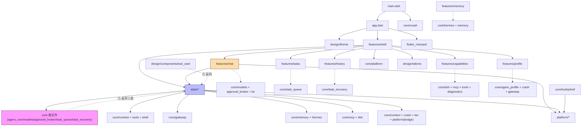

# Shelly Hermes 依赖地图(PHASE 0 审计 · 工作区 A)

> 基线 commit `5c46be2`。本文的 import 图全部来自对 `flutter/lib/**` 的实际 grep(`grep -rn "^import"`),每条边都给出文件级证据。`dart analyze` 无告警说明没有 Dart 编译器层面的循环 import;本图关心的是**架构层面**的耦合与隐式契约。

## 1. 顶层依赖全景

读法:实线 = 常规"上层→下层"依赖;虚线 = 类型级/工具级直连;标 ⚠ 的是反向或越层耦合(§3)。

## 2. 实际 import 图(grep 证据)

### 2.1 状态层 → 核心层(最重的边)

- `state/chat_session.dart:12-46` 一次性 import **26 个 core 文件 + 4 个 platform 文件**:`agent_core`、`context/context_compactor`、`dsh/tool_registry`、`approval_broker`、`crash/crash_log_store`、`gateway/openai_gateway`、`gateway/web_search`、`hermes/hermes_memory`、`hermes/knowledge_store`、`hermes/forgetting`、`hermes/knowledge_tool`、`error_messages`、`mcp/bridge_client`、`mcp/mcp_guard`、`mcp/mcp_tool_registry`、`memory/memory_extractor`、`memory/memory_store`、`runtime/hardened_tool_executor`、`models`、`runtime/agent_context`、`runtime/agent_runtime`、`runtime/tool_registry`、`shell/shell_executor`、`task_queue`、`task_recovery`、`tools/registry`、`tools/memory_search_tool`、`tools/notes_tool`、`tools/terminal_tools`、`tools/workspace`、`workspace/workspace_manager`;platform:`platform_workspace`、`conversation_images`、`process_runner`、`task_service`。
- `state/settings_store.dart:6-12` → `agent_profile`、`gateway/context_window`、`hermes/memory_settings`、`models`、`mcp/mcp_client`、`task_recovery` + `platform/secure_box`。
- `state/scheduled_tasks.dart:11-14` → `core/platform/background_tasks`、`gateway/openai_gateway`、`models`。
- `state/hermes_provider.dart:3-8` → `hermes/forgetting`、`knowledge`、`knowledge_store`、`memory_settings`、`reflection` + `tools/workspace`。
- `state/dsh_provider.dart:3-4` → `dsh/registry`、`dsh/tool_registry`。
- `state/lan_companion.dart:8-9` → `lan/lan_companion_server`、`models`。
- `state/memory_maintenance.dart:6-8` → `memory/consolidation`、`memory/memory_store`。
- `state/conversation_search.dart:1` → `models`。

### 2.2 特性层 → 核心/状态/平台(逐文件)

| 特性文件 | 直接 import(相对路径) |
| --- | --- |
| `features/chat/chat_page.dart:12-30` | core:`approval_broker`(PendingApproval)、`models`(AgentLimits、TextFileAttachment)、`tts/tts_service`;state:`chat_session`、`conversation_export`、`dsh_provider`、`settings_store`;platform:`platform_workspace`(ResilientWorkspace)、`speech`、`shared_intent`;design 7 文件;`../approval/approval_sheet` |
| `features/chat/model_picker_sheet.dart:4-8` | core:`error_messages`、`gateway/model_discovery`、`gateway/providers`;state:`settings_store` |
| `features/chat/in_chat_search.dart:3-4` / `conversation_actions.dart:4-6` | design + state(chat_session/settings_store) |
| `features/approval/approval_sheet.dart:6-11` | core:`models`(ApprovalDecision)、`approval_broker`(PendingApproval)——纯类型;state:`chat_session`;design 3 文件 |
| `features/tasks/tasks_page.dart:4-8` | core:`task_queue`(TaskStatus/TaskState);state:`chat_session`、`scheduled_tasks` |
| `features/history/history_page.dart:6-10` | core:`task_recovery`(RecoveryCandidate);state:`chat_session` |
| `features/capabilities/capabilities_page.dart:4-17` | core:`diagnostics/environment_checker`、`dsh/installer`、`dsh/plugin`、`dsh/tool_registry`(DshTrust)、`mcp/mcp_client`、`mcp/mcp_guard`、`tools/registry`;state:`chat_session`、`dsh_provider`、`plugin_repo`、`settings_store`;platform:`process_runner` |
| `features/profile/profile_page.dart:6-24` | **app.dart(themeModeProvider)**、core:`agent_profile`、`crash/crash_store`、`error_messages`、`gateway/model_discovery`、`gateway/providers`;**features/shell(home_shell 的 tabIndexProvider)**;state:`chat_session`、`lan_companion`、`settings_store`、`update_check`、`usage_stats`;platform:`platform_workspace` |
| `features/memory/memory_page.dart:11-19` | core:`hermes/forgetting`、`hermes/memory_settings`、`hermes/knowledge`、`memory/memory_store`;state:`hermes_provider`、`chat_session`、`memory_maintenance`、`settings_store` |
| `features/memory/memory_settings_page.dart:5-7` / `profile/profile_editor_sheet.dart:4-6` | core:`hermes/memory_settings` / `agent_profile`;state:`settings_store` |
| `features/shell/home_shell.dart:7-18` | core/platform:`background_tasks`、`home_widget_bridge`;state:`chat_session`、`memory_maintenance`、`scheduled_tasks`、`settings_store`;design/tokens;5 个页面 |

### 2.3 核心层内部(能力目录 → 内核根文件)

全部能力目录只向内核根文件/gateway/platform 下手,横向几乎无耦合(grep `flutter/lib/core/*/` 的相对 import 汇总):

- `runtime/*` → `../agent_core`、`../approval_broker`、`../models`、`../tools/registry`;`runtime/tool_registry.dart` → `../tools/registry`(唯一 runtime→tools 反向缝,属接口引用,健康)。
- `tools/*` → `../agent_core`、`../models`、`../runtime/tool_registry`、`../tools/registry`、`../tools/workspace`、`../crash/crash_log_store`、`../memory/memory_store`;**`tools/memory_search_tool.dart:9` → `../../state/settings_store.dart`(见 §3.1)**。
- `shell/shell_executor.dart` → `../agent_core`、`../models`、`../runtime/tool_registry`、`../tools/workspace`。
- `gateway/openai_gateway.dart` → `openai_messages`、`sse`、`http`;`agent_core.dart:5` 仅 `show CachedTokensReply` 引用 gateway 类型(内核→网关的类型级单点)。
- `mcp/mcp_tool_registry.dart` → `mcp_client`、`mcp_guard`、`../runtime/tool_registry`;`dsh/tool_registry.dart` → `../runtime/tool_registry`、`registry`。
- `hermes/hermes_memory.dart` → `../runtime/agent_context`(实现 `AgentMemoryAccess`)、`knowledge_store`、`forgetting`。
- `git/*` → `git_manager`;`context/context_compactor.dart` → gateway + models;`workspace/workspace_manager.dart` → `tools/workspace`、`project`。
- `platform/process_runner_io.dart` / `process_runner_stub.dart` → `../core/agent_core`、`../core/shell/shell_executor`(platform 依赖 core,方向正确);`platform/platform_workspace.dart:6` → `../core/tools/workspace`(实现其 Workspace 接口)。

### 2.4 设计层

- `design/components/*.dart` → 仅 `../tokens.dart`;唯一例外 `tool_card.dart:6` → `../../state/chat_session.dart`(见 §3.2)。

## 3. 循环与风险耦合清单

Dart 编译层面**没有循环 import**(`dart analyze` 无告警可证)。但以下耦合违反分层方向或绕过 facade,是 v3 迁移的收口点:

### 3.1 反向依赖:core → state(1 处)

- **`core/tools/memory_search_tool.dart:9` → `state/settings_store.dart`(仅取 `ConversationSummary` 类型)**。
  - 影响:`core/` 不再能单独发布/dart-test;`state/settings_store.dart` 一动,内核工具表受牵连。
  - 化解(不搬目录):把 `ConversationSummary` 下沉为 core 拥有的模型(state 里的 SettingsStore re-export),或改为构造注入 `List<ConversationSummary> Function()` 的调用方适配。**当前以注入方式已部分缓解**(构造参数 `loadSummaries: _store.loadConversations`,chat_session.dart:1280),剩下的只是类型归属问题。

### 3.2 反向依赖:design → state(1 处)

- **`design/components/tool_card.dart:6` → `state/chat_session.dart`**(`ToolEntry`,工具卡渲染需要 `argumentsJson/result/状态`)。
  - 影响:设计系统组件与最大状态文件(1633 行)绑定,主题/组件无法独立复用。
  - 化解:ToolCard 改收纯展示参数(或 v3 把 `ChatEntry` 族从 chat_session 拆到独立 `chat_entries.dart`)。

### 3.3 特性层绕过状态层直连 core 内部(10 处,清单)

| 文件 | 直连的 core 内部 | 风险 |
| --- | --- | --- |
| `features/capabilities/capabilities_page.dart:4-10` | `dsh/installer`、`dsh/plugin`、`dsh/tool_registry`、`mcp/mcp_client`、`mcp/mcp_guard`、`tools/registry`、`diagnostics` | 能力页直接操刀安装/信任判定,绕过 dsh_provider;DSH 内部重构(如 manifest 校验变化)直接击穿 UI |
| `features/profile/profile_page.dart:7-11` | `agent_profile`、`crash`、`gateway/model_discovery`、`gateway/providers`、`error_messages` | 网关预设/发现协议变化直接改页面 |
| `features/memory/memory_page.dart:11-14` | `hermes/*`、`memory/memory_store` | 记忆模型(v3 要扩分层)直接击穿页面 |
| `features/chat/chat_page.dart:12-13,29` | `approval_broker`(PendingApproval)、`models`(AgentLimits/TextFileAttachment)、`tts_service` | 类型级,风险低但属于"知道内核细节" |
| `features/approval/approval_sheet.dart:6-7` | `models`、`approval_broker` 类型 | 同上,审批 UI 与 broker 数据结构同构,可接受 |
| `features/tasks/tasks_page.dart:4` | `task_queue`(TaskStatus) | 类型级,可接受 |
| `features/history/history_page.dart:6` | `task_recovery`(RecoveryCandidate) | 类型级,可接受 |
| `features/chat/model_picker_sheet.dart:4-6` | `gateway/model_discovery`、`providers`、`error_messages` | 中风险:发现协议变化击穿 UI |

### 3.4 状态层 ↔ 特性层的"页面注入"耦合

- `ChatSessionController` 暴露 `setApprovalHandler()`(`chat_session.dart:220-231`),由 `_ChatPageState` 在 build 时注册弹窗处理器(`chat_page.dart` 审批流);`home_shell.dart` 又在 initState 里注册 `_widgetBridge/_bgBridge` 回调改 `tabIndexProvider`。三个"回调注册"构成页面↔控制器的双向握手,v3 换导航结构时最易断。
- `profile_page.dart:15` import `features/shell/home_shell.dart`(取 `tabIndexProvider`)+ `profile_page.dart:6` import `app.dart`(取 `themeModeProvider`):特性页反向依赖壳与 app 层。provider 定义位置(page→shell→app 三层上浮)是历史演进的痕迹,v3 应把全局 provider 收进 `state/`。

### 3.5 单例/共享可变对象

- **`ApprovalBroker` 单实例**:活在 `ChatSessionController`(`chat_session.dart:196`),`_onApprovalRequested` 把请求灌进 `approvalQueueProvider`;所有审批 UI/测试都靠它,没有任何"多 broker"概念。
- **`McpGuardLedger` 静态种子**:`chat_session.dart:1216` 调 `McpGuardLedger.seedApproved(...)`(core/mcp/mcp_guard.dart:237 的静态账本)——进程级单例,测试间需手动重置。
- **`tabIndexProvider` 全局 StateProvider**(home_shell.dart:22):被 shell/profile/chat 多处直写(`_onWidgetAction`、`_onBgCatchup`、历史页恢复跳转),tab 顺序(0=对话…4=我的)硬编码在各处 switch/常量。
- **`NotesToolRegistry` 每次 run 新建**(chat_session.dart:1202,注释明示"fresh per task run, so plan recitation state resets"):它不是单例,但其朗诵状态块通过 `recitationBodyDecorator`(chat_session.dart:1296)闭包捕获,与 gateway 装饰器链隐式绑定——装饰器持有工具注册表的引用,是装配代码里最隐蔽的一处(见 `CURRENT_ARCHITECTURE.md` §6)。
- **`MemoryStore`/`CrashLogStore`**:provider 化(`memoryStoreProvider`、conversationImageStoreProvider)但 `_TaskRunner` 里通过 future 直取(chat_session.dart:1244-1256),绕过 ref 的响应性——`_crashLogFuture/_memoryStoreFuture` 字段与 provider 双轨。

## 4. 隐式依赖(初始化顺序与契约)

### 4.1 进程启动顺序(main → app → shell)

1. `main.dart:13-16`:`WidgetsFlutterBinding.ensureInitialized()` → `SemanticsBinding.ensureSemantics()` → **await** `_installCrashLogging()`(失败静默)→ `runApp(ProviderScope(ShellyApp))`。隐式契约:crash 钩子必须在任何可能抛错的初始化之前装好;prefs 不可用时永不阻塞启动。
2. `app.dart:26-33`:`ref.watch(themeModeProvider)` → MaterialApp;web 下 `?theme=` 深链生效依赖 `kIsWeb` 分支。**SettingsStore 此时尚未加载**,主题与模型配置解耦(主题不读 prefs)。
3. `home_shell.dart:60-79` initState 顺序敏感(4 个副作用串行触发但都 fire-and-forget):
   - `_armScheduler()` → `schedulerServiceProvider.future` → **隐式依赖 `scheduledTaskStoreProvider` 与 `settingsStoreProvider` 先完成**(scheduled_tasks.dart:515-517 的 ref.watch 链);
   - `_widgetBridge.register` → 之后每次 `settingsStoreProvider` 变化触发 `pushUpdate`(home_shell.dart:165-174,依赖 `sortConversations`,chat_session 导出);
   - `_bgBridge.handlePendingCatchup` → 到期任务通知点击跳 Tab 1(**硬编码 1=任务页**,home_shell.dart:90);
   - `_runMemoryMaintenance()` → `memoryStoreProvider.future` → **隐式依赖 SharedPreferences 可用**;失败被吞(home_shell.dart:124-133)。

### 4.2 Provider 图顺序契约(无测试锁定)

- `settingsStoreProvider`(settings_store.dart:577)是根:被 `pluginRepoProvider`(plugin_repo.dart:168)、`schedulerServiceProvider`(scheduled_tasks.dart:517)、`hermesLedgerProvider`(hermes_provider.dart:96)、所有页面 watch。
- `workspaceProvider` → `workspaceManagerProvider`/`workspaceAuthorizedProvider`/`hermesLedgerProvider`(hermes_provider.dart:91-92)。
- `chatSessionProvider` 构造时读 ref(chat_session.dart:1631),但它**只在 chat 页 build 的 ref.watch(settingsStoreProvider) 数据到达后才 `attach(store)`**(chat_page.dart:532)——即"session 可用"≠"session 已绑定持久化",首次发消息前必须等 store 异步就绪,这是全应用最脆的时序假设(有 `session_management_test.dart` 兜底)。
- `memoryStoreProvider` 双消费:home_shell 维护(home_shell.dart:127)与 chat_session 注入(chat_session.dart:1622)各自 resolve,失败均静默降级为 null。
- `dshToolsProvider` ← `dshRegistryProvider` + `dshTrustProvider`(dsh_provider.dart:16-20):顺序由 Riverpod 依赖解析保证,但 `_TaskRunner` 里 `_dshTools` 是构造时捕获的实例字段——**运行中改装插件不会进入当前任务**,只在下一次 send 生效。
- `chatGatewayOverrideProvider`(`@visibleForTesting`,chat_session.dart:1617):测试覆盖入口,生产恒 null——它的存在意味着网关构建有唯一测试缝,v3 Brain 换网关时应复用这条缝。

### 4.3 其他隐式契约

- **工具表顺序即信任顺序**:`CompositeToolRegistry` 先声明者赢(runtime/tool_registry.dart:37-50 注释"core tools win over plugin tools on collision"),_TaskRunner 的组装顺序(workspace→shell→terminal→memory_search→knowledge→notes→dsh→mcp→bridge,chat_session.dart:1266-1285)是安全属性,改动需过 `tools_test.dart`/`dsh_test.dart`。
- **检查点版本**:models.dart:232-235 `AgentCheckpoint.fromJson` 只认 `version: 1`,抛 `FormatException`——v3 若改检查点结构必须兼容旧 SharedPreferences 数据。
- **审批 fail-closed**:agent_core.dart:165-168 策略抛错时强制回 `requiresApproval = true`;broker 的持久 allow 只减 ask 不加权(approval_broker.dart:71-82)。任何审批链改动都动安全边界。
- **web 调试支架参数**:`?theme=`(app.dart:13-17)、`?tab=N`(home_shell.dart:72-79)是验证工具的公开契约,重构壳/主题时不能静默改名。

## 5. v3 facade 收口优先级(结论)

1. **P0**:`core/tools/memory_search_tool.dart` 的 `ConversationSummary` 归属(§3.1)——唯一真正的分层倒置。
2. **P0**:工具表组装顺序(chat_session.dart:1266-1285)加测试快照——安全属性,迁移期最怕无感漂移。
3. **P1**:`design/components/tool_card.dart` 与 `state/chat_session.dart` 解耦(§3.2)。
4. **P1**:capabilities/profile/memory 三页的 core 直连改走 provider/facade(§3.3)。
5. **P2**:`tabIndexProvider`/`themeModeProvider` 迁入 `state/`;init 副作用收口为显式的 `AppBootstrap` 顺序清单(§4.1)。
6. **P2**:session attach 时序(§4.2 第 4 条)改为显式状态机,替代"等 build 再 attach"的隐式握手。
